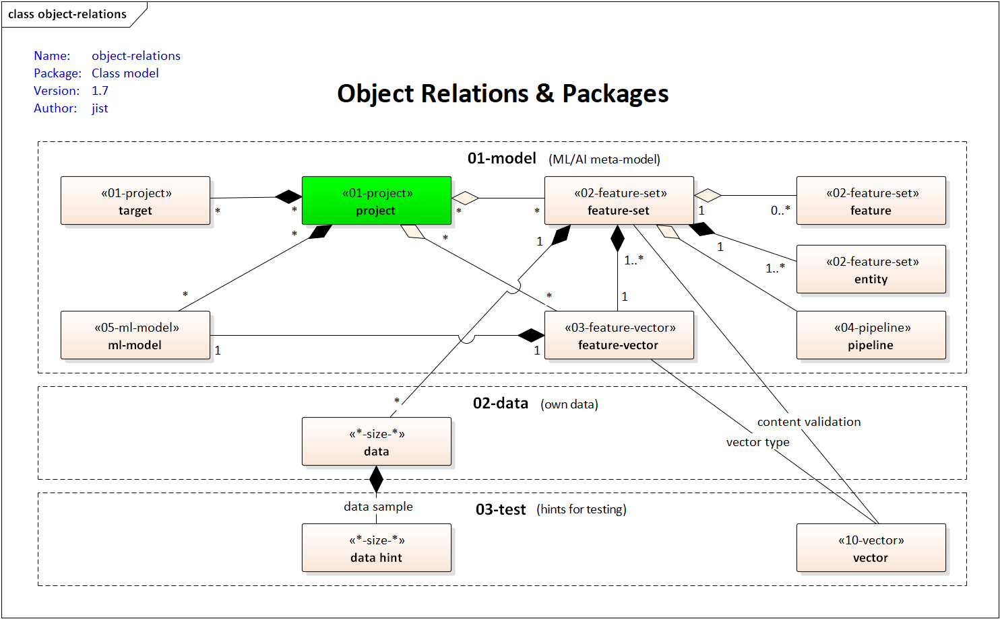
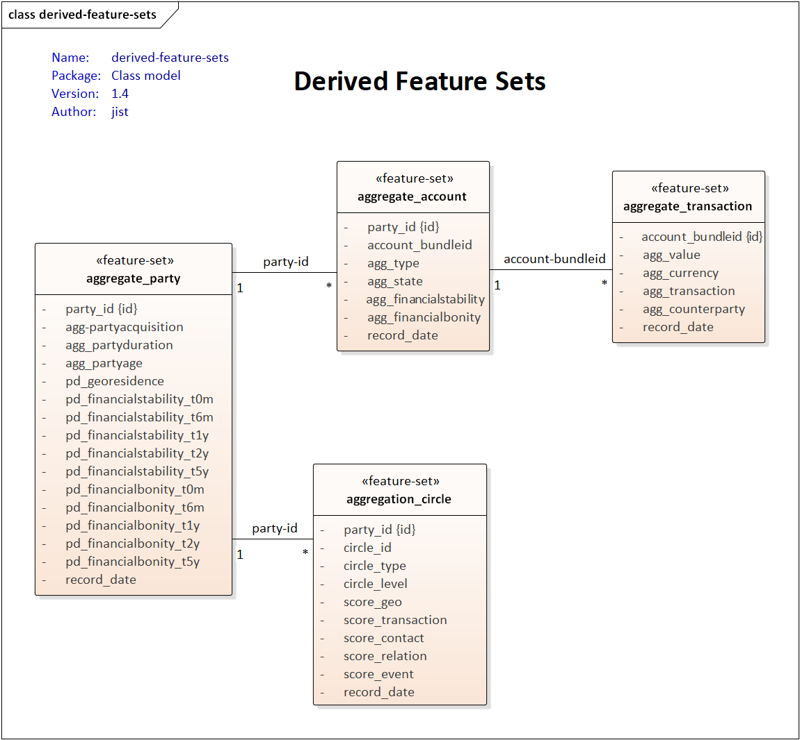

 

# QGate-Model
The machine learning meta-model with synthetic data (useful for MLOps/feature store), is independent of machine
learning solutions (definition in json, data in csv/parquet).

 

## Usage
This meta-model is suitable for:
 - compare capabilities and functions of machine learning solutions (as part of RFP/X and SWOT analysis)
 - independent test new versions of machine learning solutions (with aim to keep quality in time)
 - unit, sanity, smoke, system, regression, function, acceptance, performance, shadow, ... tests
 - external test coverage (in case, that internal test coverage is not available or weak)
 - etc.

Note: You can see real usage in e.g. project **[qgate-sln-mlrun](https://github.com/george0st/qgate-sln-mlrun)** for testing MLRun/Iguazio solution.

## Structure
The solution contains this simple structure:
 - **00-high-level**
   - The high-level [view](#model) to the meta-model for better understanding
 - **01-model**
   - The definition contains 01-projects, 02-feature sets, 03-feature vectors, 
   04-ml models, etc. in JSON format
 - **02-data**
   - The synthetic data for meta-model in CSV/GZ and parquet formats for party, account,
   transaction, event, communication, etc.
   - You can also generate your own dataset with requested size (see samples `./02-data/03-size-10k.sh`, 
   `./02-data/04-size-50k.sh`, etc. and description `python main.py generate --help`)
 - **03-test**
   - The information for test simplification e.g. feature vector vs on/off-line data, 
   test/data hints, pipeline setting, etc.

Addition details, [see structure](./docs/structure.md) and [see rules](./docs/rules.md)

## Expected integrations
The supported sources/targets for realization (✅ done, ✔ in-progress, ❌ planned), see 
the definition `/spec/targets/` for project in JSON files:
 - ✅ Redis, ✅ MySQL, ✅ Postgres, ✅ Kafka 
 - ✅ Parquet, ✅ CSV

## Meta-Model

The object relations contain relations between key objects in meta-model, plus
splitting these objects in packages (01-model, 02-data, etc.)

The basic feasture sets contains view to basic feature sets and relations between them.

The derived feasture sets contains view to derived feature sets and relations
between them.

